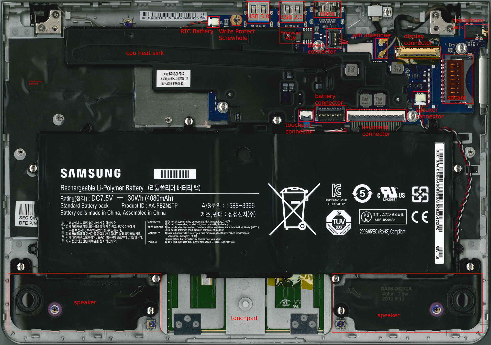
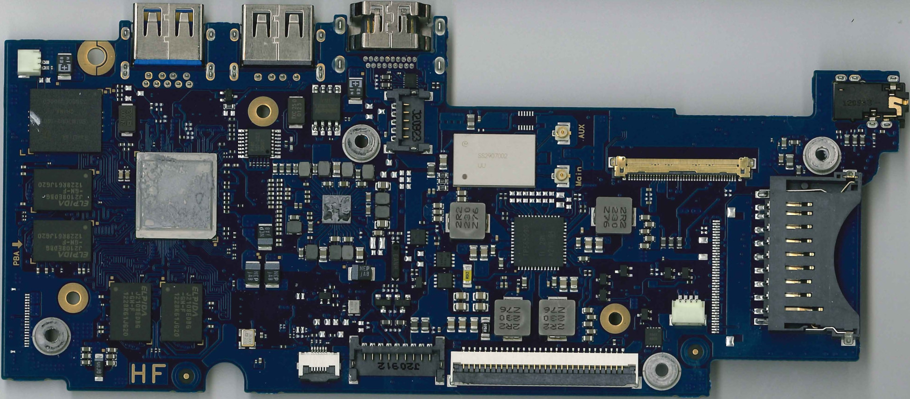
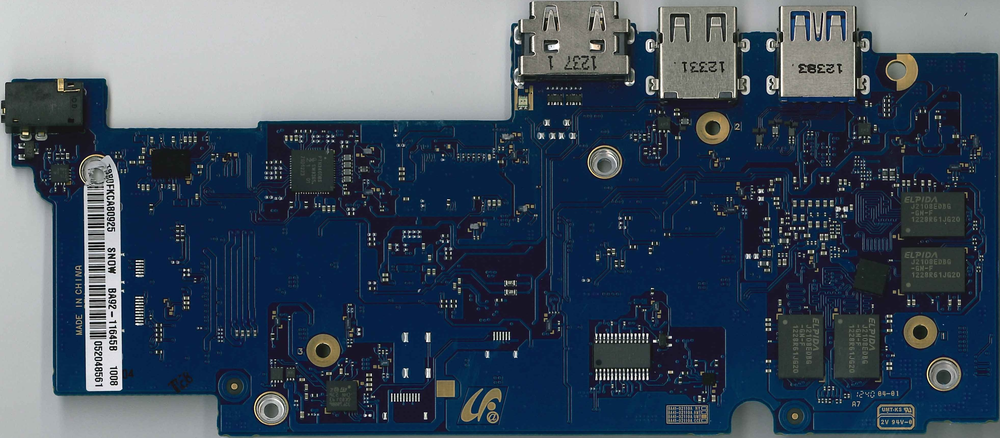

CrOS calls this "daisy-snow", model number on the case is XE303C12.

There is some coreboot support that apparently hasn't been tested in a very long time,
and the Exynos5250 BL1 firmware in the coreboot blobs repo is a placeholder. Actual
BL1 firmware [can be found here][5250bl1] (link to Google CrOS distfiles, bzip2'd tarball).
Attempting to use the default libreboot configs ([since removed, commit][lbcfg]) with
inserted BL1 doesn't get far...

Did support for this board ever make it into U-Boot upstream??

## Photos of the guts

(below photos are from the [CrOS dev wiki][crdw])

[5250bl1]: http://commondatastorage.googleapis.com/chromeos-localmirror/distfiles/exynos-pre-boot-0.0.2-r8.tbz2
[lbcfg]: https://codeberg.org/libreboot/lbmk/commit/62cf9939042e7adc80b58dc436f2e8335c492767
[crdw]: https://www.chromium.org/chromium-os/developer-information-for-chrome-os-devices/samsung-arm-chromebook/
