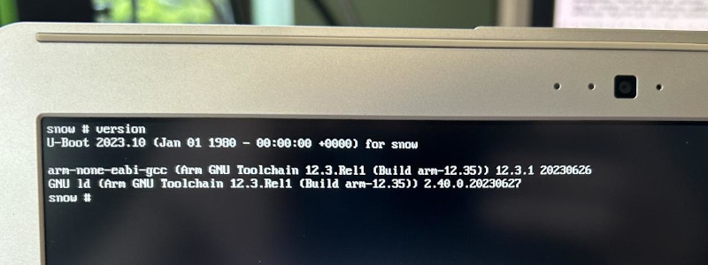

CrOS calls this "daisy-snow", model number on the case is XE303C12.

There is some coreboot support that apparently hasn't been tested in a very long time,
and the Exynos5250 BL1 firmware in the coreboot blobs repo is a placeholder. Actual
BL1 firmware [can be found here][5250bl1] (link to Google CrOS distfiles, bzip2'd tarball).
Attempting to use the default libreboot configs ([since removed, commit][lbcfg]) with
inserted BL1 doesn't get far...

## Using upstream U-Boot



Upstream U-Boot has `snow_defconfig` which does compile cleanly from a v2023.10 checkout,
and gives us an SPL + U-Boot binary.

Creating an image for the onboard SPI flash is a bit of a hassle - but it does work!
The BL1 blob has to be at the start of the image, followed by the Exynos-specific SPL
(`spl/smdk5250-spl.bin` after building), and then the U-Boot image (`u-boot-dtb.bin`).

I also threw together a CrOS `flashmap` layout for it - though I don't think that's
really necessary.

<details>
<summary markdown='span'>`flashmap` layout for U-Boot</summary>
```
fmap_signature="0x5f5f464d41505f5f" fmap_ver_major="1" fmap_ver_minor="0" fmap_base="0x0000000000000000" fmap_size="0x400000" fmap_name="FMAP" fmap_nareas="5"
area_offset="0x00000000" area_size="0x00200000" area_name="RO_SECTION" area_flags_raw="0x01" area_flags="static"
area_offset="0x00000000" area_size="0x00002000" area_name="BL1" area_flags_raw="0x01" area_flags="static"
area_offset="0x00002000" area_size="0x00004000" area_name="SPL" area_flags_raw="0x01" area_flags="static"
area_offset="0x00006000" area_size="0x001fa000" area_name="U_BOOT" area_flags_raw="0x01" area_flags="static"
area_offset="0x00200000" area_size="0x00001000" area_name="FMAP" area_flags_raw="0x01" area_flags="static"
```
</details>

I flashed this externally (CH341A + a clip), though flashing internally from CrOS (with
the WP screw removed) should also work.

[Here is a link to a pre-built image, ready to flash.][spiimg] No guarantees, etc.

## Photos of the guts

<details>
<summary markdown='span'>Photos stolen from the CrOS developer wiki</summary>
[Here's the source page for these.][crdw]


</details>

[5250bl1]: http://commondatastorage.googleapis.com/chromeos-localmirror/distfiles/exynos-pre-boot-0.0.2-r8.tbz2
[lbcfg]: https://codeberg.org/libreboot/lbmk/commit/62cf9939042e7adc80b58dc436f2e8335c492767
[spiimg]: https://archive.catstret.ch/lab/daisy-snow/1699257286_uboot_202310_spi_daisy-snow.bin
[crdw]: https://www.chromium.org/chromium-os/developer-information-for-chrome-os-devices/samsung-arm-chromebook/
